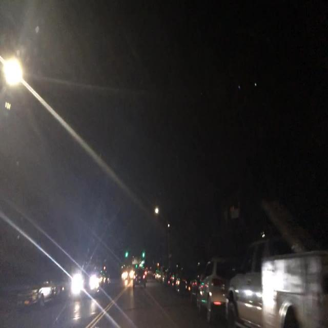

# 015 Night Person and Car Detection

> A low-light person/car detection workflow with domain fine-tuning, evaluation, independent testing, and batch inference.

## Problem

General detectors can miss people and vehicles at night or at small scale, while direct deployment is hard to reproduce.

## Demo

Run inference on a night image and inspect the person/car boxes and confidence.

Data, weights, evaluation, and batch-inference scripts live in one traceable project layout.

## Highlights

- YOLO26m-P2 fine-tuned for night scenes.
- About 3,000 labeled night images.
- Training, evaluation, independent testing, and batch inference.
- Supports GPU/CPU inference and Windows tooling.

## Tech

`Python · Ultralytics YOLO · PyTorch · OpenCV · CUDA/CPU`

## Reproduce from ZIP

1. Extract the ZIP, create a virtual environment, and install `requirements.txt`.
2. Run `python -c "import torch; print(torch.cuda.is_available())"` to check the training GPU first.
3. Follow `README_LOCAL_QUICKSTART` for testing or training commands.
4. Run inference on the included test images before evaluating your own night data.

**Expected result:** After these steps, you should see the project's page, window, device output, or test result.

## Scope and Safety

Training requires a GPU; the included data and weights represent this experiment and do not guarantee the same result for every night road scene.

## Contact

Open to technical exchange.
